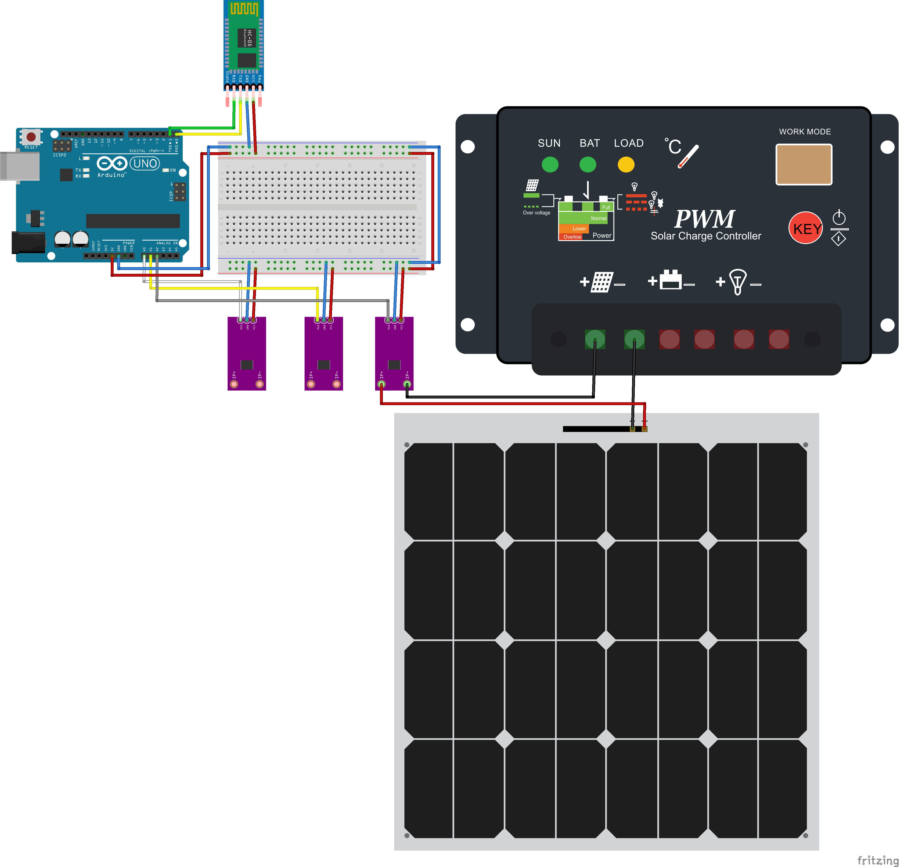

# Power_BT

Code used for acquiring information regarding power consumption
(voltage, ampere, watt).
The code was written for an Arduino Uno.

## Installation

## Assemble the circuit

Assemble the circuit following the diagram layout.png attached to the sketch.

## Load the code

The code only imports two libraries: Wire and ArduinoJson.
Both of them can be found in the library manager of Arduino IDE.
After importing the libraries, simply compute and upload the code.

## BOM

| ID |    Part Name   | Part Number | Quantity |
|----|----------------|-------------|----------|
| BT | BT module      |    HC-05    |     1    |
| CS | Current Sensor | ACS758 100B |     3    |

## Authors

* **Mário Antunes** - [mariolpantunes](https://github.com/mariolpantunes)

## License

This project is licensed under the MIT License - see the [LICENSE.md](../LICENSE.md) file for details
